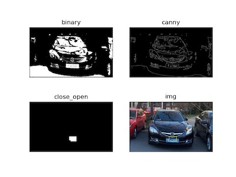

# Plate Localization

## 实现方法

### 颜色二值化

```py
def color_binary(img_bgr):
    img_hsv = cv2.cvtColor(img_bgr, cv2.COLOR_BGR2HSV)
    # 适当放宽颜色范围
    lower_blue = np.array([100, 80, 80])
    upper_blue = np.array([124, 255, 255])
    img_binary = cv2.inRange(img_hsv, lower_blue, upper_blue)

    return img_binary
```

将输入的 RGB 格式图像转换为 HSV 格式, 然后用 cv2.inRange 函数 (相当于一层 mask), 把在蓝色范围内的像素格子置为 255, 不在蓝色范围内的置为 0

<div STYLE="page-break-after: always;"></div>

### 车牌定位

本实验采用蓝色识别 + 边缘检测方法进行定位

```py
def plate_locate(img_bgr):
    """ TODO starts """
    # 使用蓝色识别 + 边缘检测方法
    # 1. 蓝色二值化
    img_binary = color_binary(img_bgr)
    plt.subplot(221), plt.imshow(img_binary, "gray"), plt.title("binary"), plt.xticks([]), plt.yticks([])

    # 2. 边缘检测
    img_canny = cv2.Canny(img_binary, 200, 500)
    plt.subplot(222), plt.imshow(img_canny, "gray"), plt.title("canny"), plt.xticks([]), plt.yticks([])

    # 3. 开闭运算
    img_close_open = close_open(img_canny)
    plt.subplot(223), plt.imshow(img_close_open, "gray"), plt.title("close_open"), plt.xticks([]), plt.yticks([])

    img4contour = img_close_open.copy()

    # please prepare a numpy.array (size_x, size_y) img4contour for search_contour_box() func next
    """ TODO ends """

    """ draw the boxes[0] by default """
    boxes = search_contour_box(img4contour)
    if len(boxes) > 0:
        cv2.polylines(img, [boxes[0].ravel().reshape(4, 2)], True, (0, 255, 255), 2)
    else:
        print("No plate found!")

    return img
```

<div STYLE="page-break-after: always;"></div>

## 运行效果




## 说明

1. 蓝色识别的方法对于除了蓝色和黑色以外的车效果较好, 对于蓝色车和黑色车 (由于反射天空容易出现蓝色), 可以添加一个使用对车牌字体进行边缘检测方法的备用手段
2. 稍微修改了参数设置 (主要是增大了开闭运算的结构元), 使得车牌被数字和字母隔开的部分可以重新连接起来